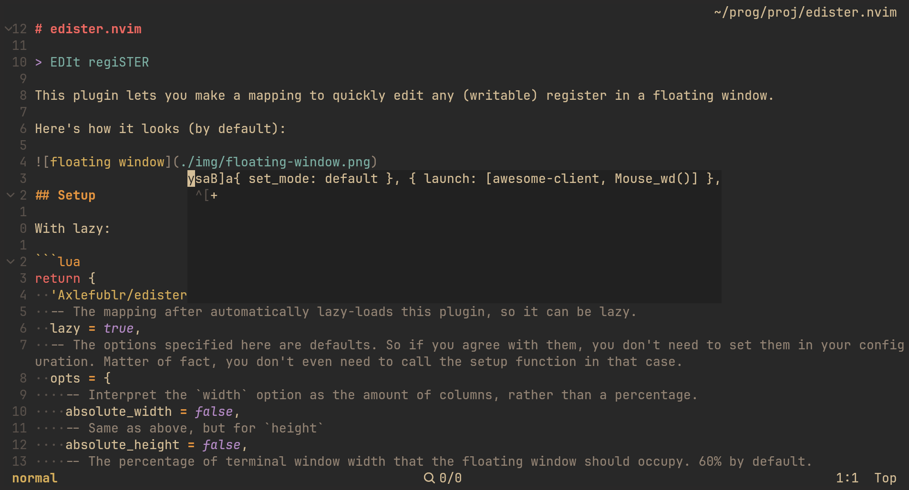

# edister.nvim

> EDIt regiSTER

This plugin lets you make a mapping to quickly edit any (writable) register in a floating window.

Here's how it looks (by default):



## Setup

With lazy:

```lua
return {
  'Axlefublr/edister.nvim',
  -- The mapping after automatically lazy-loads this plugin, so it can be lazy.
  lazy = true,
  -- The options specified here are defaults. So if you agree with them, you don't need to set them in your configuration. Matter of fact, you don't even need to call the setup function in that case.
  opts = {
    -- Interpret the `width` option as the amount of columns, rather than a percentage.
    absolute_width = false,
    -- Same as above, but for `height`
    absolute_height = false,
    -- The percentage of terminal window width that the floating window should occupy. 60% by default.
    width = 0.6,
    -- Same as above, but for height. 30% by default.
    height = 0.3,
    -- If unset, center the floating window vertically. If set to a number, offset the window that many columns from the left side of your neovim window.
    columns = nil,
    -- Same as above, but *horizontally* instead, and from the top side of your neovim window. If you don't set `rows` and `columns`, the floating window is fully centered.
    rows = nil,
    -- Expects the same thing as the `border` option in `:h nvim_open_win()`. No borders by default.
    border = nil,
  }
}
```

And somewhere in your configuration, you should also add the mapping to use the plugin:

```lua
vim.keymap.set('n', '<Leader>g', function() require('edister').edit_register() end)
```

## Usage

### `require('edister').edit_register(register, reg_type)`

#### `register`

The first argument is the `register` that you want to edit.

However, if you don't specify that argument (or set it to `nil`), a register is going to be automatically asked from you, interactively.

So, the workflows ends up being something like this:

> "oh damn, I messed up that macro in the q register, gotta edit it now!"

Then you press `<Leader>g` and see an input prompt, asking you to enter a register. This input prompt just expects you to press a single character, and makes sure that what you enter is a valid, writable register.

So now you can just press `q` and you'll see the floating window! Edit the register however you like, then close the window. Your changes are saved! I have to warn you though, your changes are going to be saved even if you didn't _save_ and close, and instead just closed.

Valid (writable) registers are: `", +, *, #, =, _, /, 0-9, a-z, A-Z`. Uppercase registers aren't different from lowercase registers in this plugin, they're supported just so you could accidentally press shift and still use the plugin fine.

There is an extra, special "register" that you can use: `'`. It resolves into whatever you default register practically is. If your `clipboard` option is set to `unnamedplus` or `unnamedplus,unnamed`, you end up with `+`. If it is `unnamed` or `unnamed,unnamedplus` — `*`. If it is anything else, you end up with `"`.

#### `reg_type`

The second argument is the type of the register that you want it to be. Registers can be linewise, characterwise, blockwise. By default, the type of an edited register stays the same. So if you edit a linewise register, it stays linewise. Editing a characterwise register? Yep, will also stay characterwise.

But you can pass the `reg_type` argument to change some register's type to another one. `reg_type` accepts the same things as `:h setreg()` does, for specifying the register type.

If you set `reg_type` to the special variant "ask", then, after you close the floating window, you will be interactively asked for the register type that you want. Press a single character out of l (linewise) / c (characterwise) / b (blockwise), and the register will be turned into that type (keeping your edit).

If you pressed escape, your edit isn't saved at all. You get to have the option of the final "nevermind" here, unlike in default behavior. If the character you pressed isn't one of l / c / b, the previous register type will be kept, and your edit _will_ be saved.

Suggested mapping:

```lua
vim.keymap.set('n', '<Leader>G', function() require('edister').edit_register(nil, 'ask') end)
```

It also may be viable to have this as your default mapping, if you're okay with having to press an additional key every time you want to edit a register.

### `require('edister').move_from_one_to_another(one, another, reg_type)`

```lua
vim.keymap.set('n', '<Leader>f', function() require('edister').move_from_one_to_another() end)
vim.keymap.set('n', '<Leader>F', function() require('edister').move_from_one_to_another(nil, nil, 'ask') end)
```

This function lets you move the contents of a register into another register.

`one` is the register you want to move *from*, and `another` is the register you want to move into.

`another` works like the register argument in `edit_register`: among many things, it can only be a writable register.

`one` can accept any *readable* register (which means any register), so including writable registers, it also has `%`, `:`, `.`.

It has a special one as well: `;` gets turned into `:`. This is just so you don't have to press shift.

(the `'` special register still works, in exactly the same way)

`reg_type` is exactly the same as in `edit_register`.

The reasoning for this function existing, is that I often copy something, only to realize one second later that I wanted to copy something into a register. You can now do this retroactively, thanks to this functionality.

Then, maybe you want to paste something from a register in multiple places. You'll have to do `"ap` again and again. Now you have the option to just `<Leader>fa'` to move the contents of `a` into your default register, to be able to paste things with just `p`.

Then, the really advanced usecase is to use this functionality to turn a register from one type to another. Copy / delete / change / whatever something characterwise, then do `<Leader>F''l` to turn that characterwise thingy into a linewise thingy. If it's just a one time thing, I recommend `:h :put`, but if you intend to use what you copied multiple times, this approach is a lifesaver.

Also, a weird hack: the `_` register is technically readable, although it will never contain anything. So you can now do `<Leader>f_a` to clear the `a` register.
